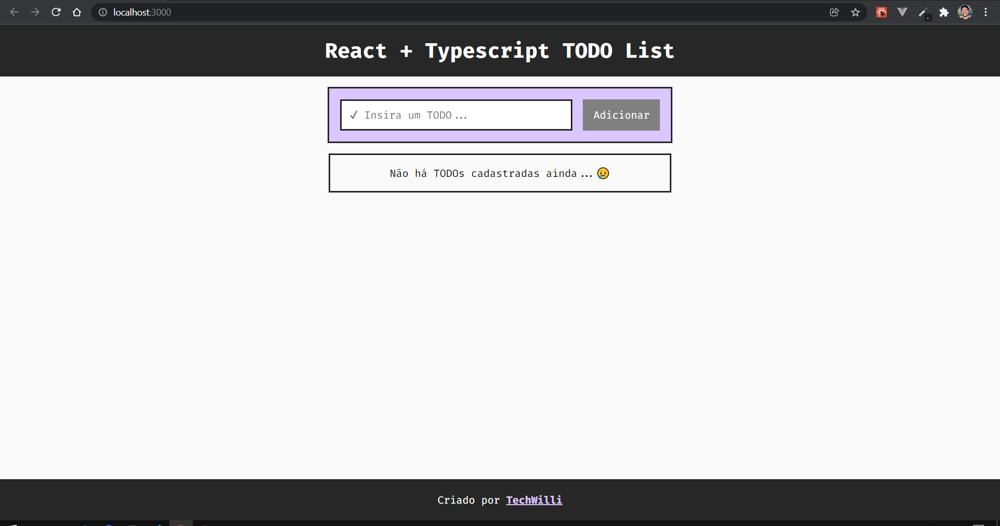
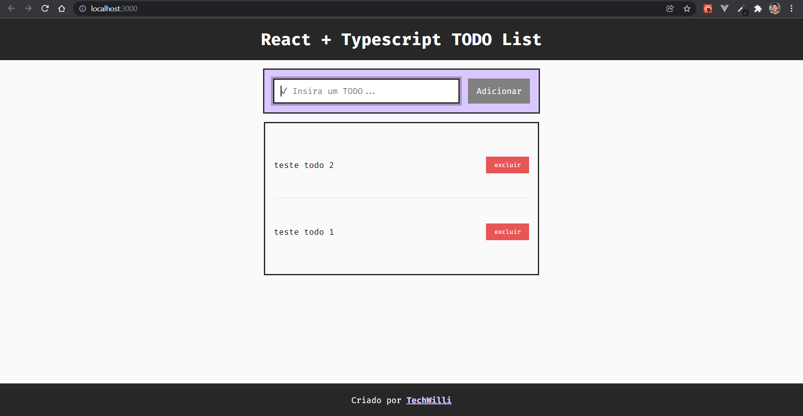

# TODO List bem simples para treinar conceitos de TypeScript com react

### Uma aplicação simples com a clássica lista de TODOs. A estrutura em um form com o input para o TODO e o botão de adicionar. Nas ações da listagem tem apenas a funcionalidade de exclusão.

### imagens da aplicação abaixo:
 

 

